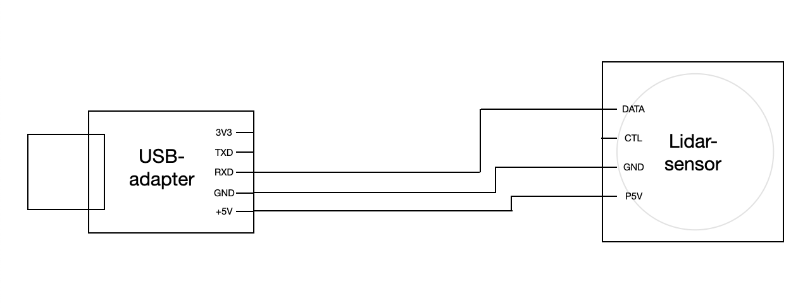
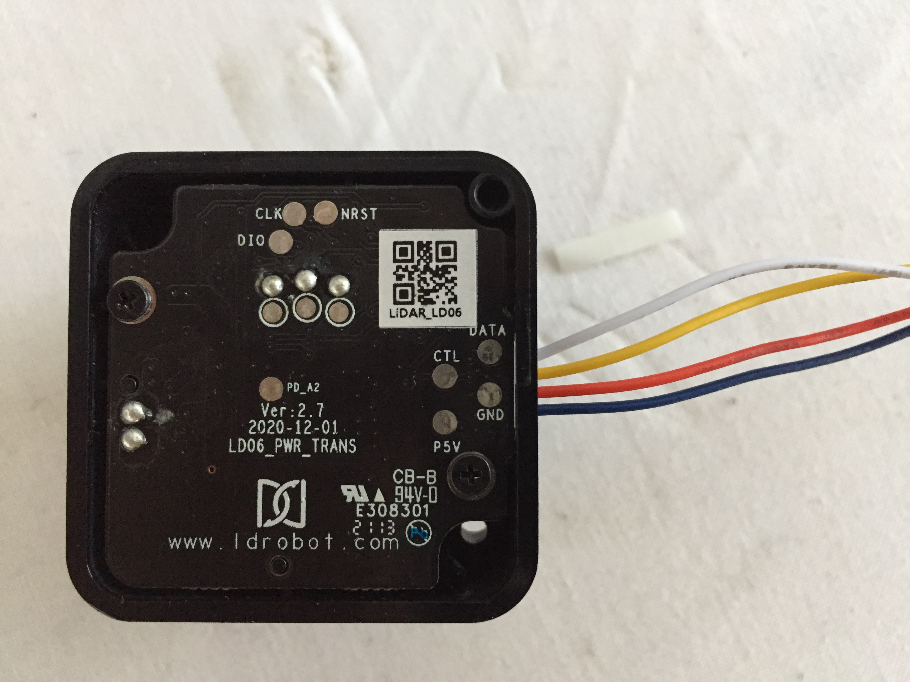
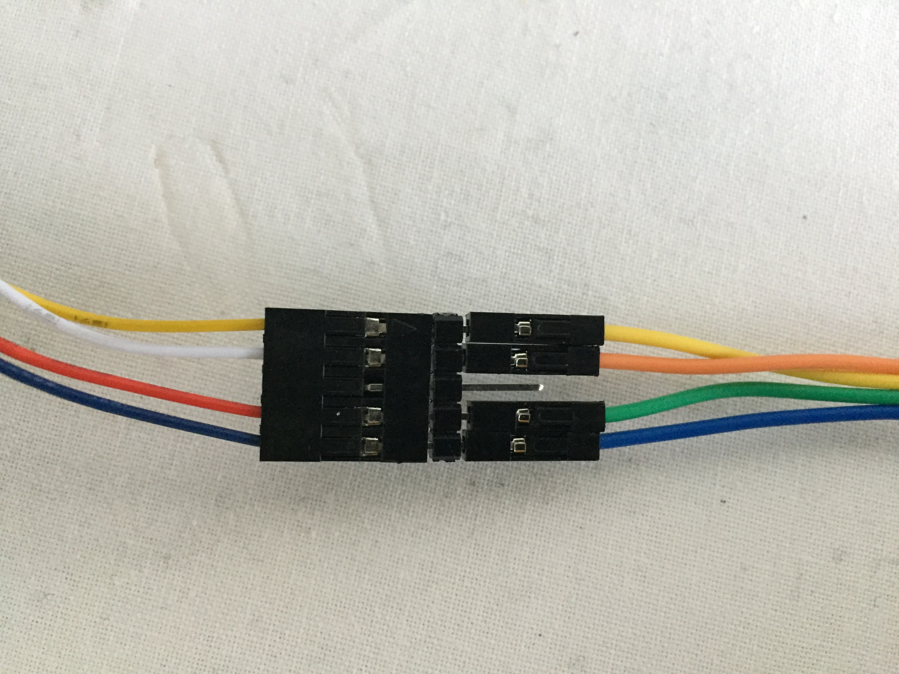
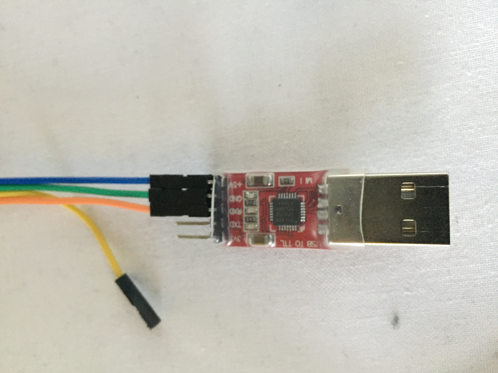

# Assembling Lidar-Sensors

In order to connect the sensors to the Raspberry Pis, they have to be wired to a USB-adapter. This way, one can connect the Lidars directly to the USB-port of the Raspberry Pis. 

## Channel Assignment

### Wiring

This documentation is based on a LIDAR_LD06 sensor and a USB-to-TTL-adapter CR2102. 

The pin labeling may vary slightly, if using other models.

The following list, plans and photos show how the sensor and adapter have to be wired

| assignment Lidar | cable-colour lidar | cable-colour Adapter |assignment Adapter |
|:----------|:------| :------| :------|
| DATA| white | orange |  RXD |
| CTL| yellow (not assigned) | yellow (not assigned) | not assigned |
| GND| red    | green  | GND |
| P5V| blue   | blue   | +5V |
|||not assigned| 3V3|
|||not assigned| TXD|

### Isolation

After the whole cables are wired, they can be isolated with shrink wrap, which also carries the advantage of a certain amount of strain relief. 

The shrink wrap used in this case are 16mm and 9.5mm (diameters before shrinkage)
