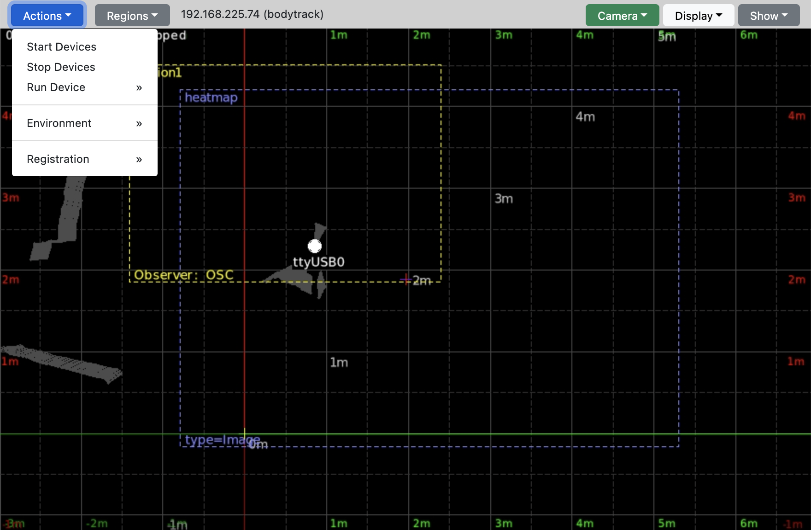

Web GUI
===========

In a web browser open the URL `http://myhost.mydomain.de:8080`

Replace `myhost.mydomain.de` by the host name or ip adress of the host running the application.

If the browser runs on the same computer, type `http://localhost:8080`

Sensor Data is displayed as small points, points belonging to a detected object on the sensor level are bigger.

Tracked Objects are displayed as green circles with the tracking ID (tid) in the center.

A sensor is shown as a big spot with the name of the sensor underneath.

The scanned environment is displayed as gray lines from the environment point to the threshold.

Regions are displayed as dashed rectangles, region name on the top left, observers using the region bottom left.

The grid is in meter, with dashed lines every 50cm.

## Actions

The ***Actions*** menu let you Start/Stop the connected lidar devices even if they are remotly connected as virtual devices, start individual devices, scan the environment or do automatic registration of lidars via a 2D marker in the room. 

### Start / Stop Devices

The menu entries ***Start Devices*** and ***Stop Devices*** operate on all connected lidar devices even if they are remotly connected as virtual devices. Single devices can be started and stopped within the submenu ***Run Device***.

### Environment

The **Environment** are all permanent objects or walls within the spatial environment, which are not to be perceived/reported by the lidar sensors.

***Scan Environment*** scans the environment for 10sec and builds up a map of invisible samples with a security threshold. To be persistent, the scanned environment must be **saved** with ***Save Environment***. If anything went wrong, the environment can be **reloaded** from the last saved environment without restarting the application with ***Reload Environment***.

***Reset Environment*** deletes all scanned environment samples (without saving) for a fresh environment. If you want to have a clean environment permanently, save it.

***Use Environment*** switches usage/application of the environment.

### History

**Commit Checkpoint** creates a checkpoint with the current definition of:

- blueprint and occlusion map

- groups

- niknames

- environment

- registration

Create a checkpoint once you finished the setup.

### Reboot Node

Reboots the selected node or this computer. Use with caution.

## Camera / Device

The ***Camera / Device*** menu determines the target of interactive transformation like position and rotation.

The ***Camera*** can beshifted by moving the mouse with the **left mouse button** pressed.

The selected ***Devices*** can be **shifted** by moving the mouse with the **left mouse button** pressed and **CTRL key** pressed.

Selected ***Devices*** can be also be **rotated** by moving the mouse with the **left mouse button** pressed and **ALT key pressed**.

Toggle on single devices if you want to transform just these. 

***Reset*** resets the transformation of the current selection.

***Reload Registration*** loads the last saved transformation (registration) of devices from file and thus undos the current changes.

***Save Registration*** saves the current transformation (registration) of devices to file.

The main menu entry shows the name of the current selection (*Camera*/*Device*), indicating the current edit target.

## Display

The ***Display*** menu controls the display of information in the graphical window.

| Entry             | Description                                                            |
|:----------------- |:---------------------------------------------------------------------- |
| Points            | display sensor scan points                                             |
| Lines             | display lines between sensor and scan points                           |
| Outline           | connects all points belonging to an object with a line                 |
| Coverage          | cover all detected scans with lines including the detected environment |
| Environment       | display scanned environment points                                     |
| Environment Thres | display environment threshold                                          |
| Tracking          | display tracked objects on the sensor fusion level                     |
| Stages            | display tracked objects on per sensor before sensor fusion             |
| Regions           | display regions as rectangles                                          |
| Device Info       | display info about devices on the top left like frame rate etc.        |
| Observer Status   | display Observer Status on top right                                   |
| Grid              | show grid in the background                                            |
| Obstacles         | show obstacle if present                                               |
| Blueprint         | show blueprint if present                                              |

## Show

The ***Show*** menu allows to toggle the visibility of individual devices. This allows to display only single or a view devices for solving difficulties. 

